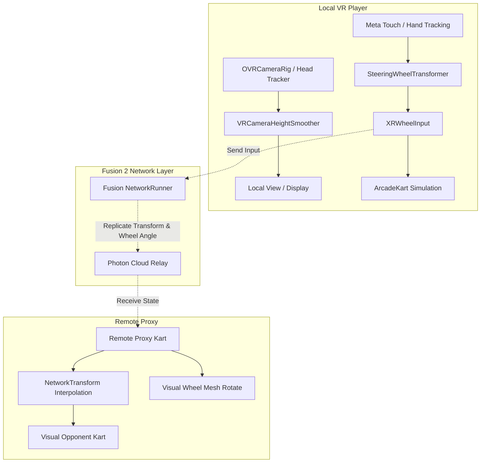

# Multiplayer Architecture Specification: xr-racing

**Project:** `xr-racing`  
**Networking Framework:** Photon Fusion 2 (v2.0.x, located at `Assets/Photon/Fusion`)  
**Target Platform:** Meta Quest Standalone VR (72/90/120 Hz)  
**Status:** Architecture Blueprint / Scaffold Phase  

---

## 1. Overview & Objectives

This document establishes the networking architecture for bringing multiplayer racing to `xr-racing`. In standalone VR, networking demands strict latency and comfort constraints: physics mispredictions or forced camera snaps cause simulation sickness.

### Core Principles
1. **Comfort First:** The local player's camera rig, head tracking, and grabbable steering wheel transformer are **100% locally simulated** with zero network delay or rollback.
2. **Input Abstraction Reuse:** Networked karts plug into the existing [`BaseInput`](file:///C:/Users/super/OneDrive/Documents/GitHub/xr-racing/xr-racing-app/Assets/Gameplay/Scripts/KartSystems/Inputs/BaseInput.cs) abstraction without altering [`ArcadeKart`](file:///C:/Users/super/OneDrive/Documents/GitHub/xr-racing/xr-racing-app/Assets/Gameplay/Scripts/KartSystems/ArcadeKart.cs) physics.
3. **No Direct Head Replication:** Opponent head poses are never directly snapped to raw remote HMD tracking data; only the kart chassis, driver character model, and visual steering wheel angle are replicated.

---

## 2. Topology Selection

Photon Fusion 2 supports two primary topologies:

| Topology | Strengths in VR | Weaknesses | Recommendation |
| :--- | :--- | :--- | :--- |
| **Shared Mode** | • Instant client authority over local kart position.<br>• Zero input latency for steering and pedals.<br>• Simplified NAT traversal via Photon Cloud.<br>• No dedicated server costs. | • Susceptible to physics desync on hard kart-to-kart collisions.<br>• Client-authoritative state. | **Recommended for Phase 1 (Prototypes, Time Trials, Ghost Laps, & Casual Lobbies).** |
| **Host / Server Mode** | • Authoritative physics simulation on host.<br>• Prevents cheating/tampering.<br>• Deterministic collision resolution. | • Remote client inputs suffer round-trip lag before physics simulates, requiring client-side prediction and resimulation rollback (can feel jerky in VR). | **Evaluate for Phase 2 (Competitive Ranked Racing).** |

---

## 3. Networked State Schema

For each kart in the session, the networked state payload is kept minimal to preserve Quest Wi-Fi bandwidth:

```csharp
public struct NetworkKartInputData : INetworkInput
{
    // Compressed 0..1 analog values
    public float TurnInput;    // -1.0 to +1.0 (clamped wheel angle)
    public float Accelerate;   // 0.0 to 1.0 (trigger / curl)
    public float Brake;        // 0.0 to 1.0 (button / curl)
}
```

### Networked Kart State (`[Networked]` Properties on `NetworkKart`):
- `[Networked] public NetworkTransform Transform { get; set; }`: Kart chassis world position & orientation interpolated via Fusion's snapshot interpolation.
- `[Networked] public float VisualWheelAngle { get; set; }`: Replicated angle (-90° to +90°) driving the opponent kart's steering wheel mesh and driver avatar hand placement.
- `[Networked] public int LapNumber { get; set; }`: Race progress state.
- `[Networked] public float CurrentLapTime { get; set; }`: Timing synchronization.

---

## 4. VR Comfort & Decoupling Architecture



### Critical Rules for VR Multiplayer
1. **Never network the camera or eye point:** The local `OVRCameraRig` is childed to the local kart. Remote players see an animated low-poly driver model seated in the kart, not a floating VR camera rig.
2. **Decouple Physics from Rendering:** Remote karts use smooth interpolation (`NetworkTransform`) with dead reckoning rather than raw physics simulation to ensure smooth 90Hz/120Hz visual motion even under minor packet jitter.

---

## 5. Implementation Roadmap (Phased)

1. **Phase 1: Lobby & Spawning (Scaffolding)**
   - Create `NetworkRunner` manager prefab in `Assets/Gameplay/Prefabs/Network/`.
   - Add simple matchmaker UI to connect 2–4 Quest headsets in the same Photon app room.
2. **Phase 2: Kart Synchronization**
   - Attach `NetworkObject` and `NetworkTransform` to kart root.
   - Implement `NetworkKartInput` implementing `BaseInput`, allowing `ArcadeKart` to consume inputs regardless of whether the driver is local or remote.
3. **Phase 3: Race Manager & Collisions**
   - Synced countdown timer and lap checkpoint detection.
   - Soft physics collision boundaries to prevent harsh VR camera impacts.
